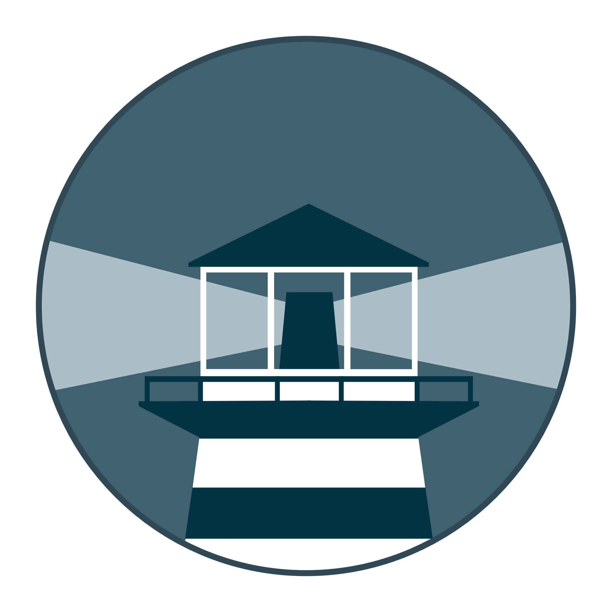

<div align="center">
  
  
  # Watch 360
  
  A process for automating Docker container base image updates.
  <br/><br/>
  
  [](https://circleci.com/gh/containrrr/watch360)
  [](https://codecov.io/gh/containrrr/watch360)
  [](https://godoc.org/github.com/devops-golang/watch360)
  [](https://goreportcard.com/report/github.com/devops-golang/watch360)
  [](https://github.com/devops-golang/watch360/releases)
  [](https://www.apache.org/licenses/LICENSE-2.0)
  [](https://www.codacy.com/gh/containrrr/watch360/dashboard?utm_source=github.com&amp;utm_medium=referral&amp;utm_content=containrrr/watch360&amp;utm_campaign=Badge_Grade)
  [](#contributors)
  [](https://hub.docker.com/r/containrrr/watch360)

</div>

## Quick Start

With watch360 you can update the running version of your containerized app simply by pushing a new image to the Docker Hub or your own image registry. 

Watchtower will pull down your new image, gracefully shut down your existing container and restart it with the same options that were used when it was deployed initially. Run the watch360 container with the following command:

```
$ docker run --detach \
    --name watch360 \
    --volume /var/run/docker.sock:/var/run/docker.sock \
    howsen82/watch360
```

Watchtower is intended to be used in homelabs, media centers, local dev environments, and similar. We do **not** recommend using Watchtower in a commercial or production environment. If that is you, you should be looking into using Kubernetes. If that feels like too big a step for you, please look into solutions like [MicroK8s](https://microk8s.io/) and [k3s](https://k3s.io/) that take away a lot of the toil of running a Kubernetes cluster. 

## Documentation

The full documentation is available at https://containrrr.dev/watch360.
